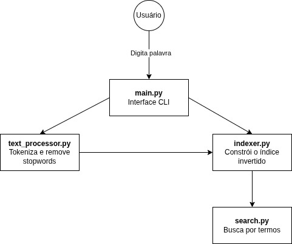

## DocFinder: Sistema de Busca de Documentos por Conteúdo com Índice Invertido

### Membros da Equipe
Yasmin Victoria Oliveira RA: 812308

## Definição da Aplicação
O projeto consiste no desenvolvimento de um sistema de busca textual que permite localizar documentos com base nas palavras contidas neles.
A proposta é construir um índice invertido, que associa cada palavra-chave aos documentos onde ela aparece, permitindo buscas rápidas e eficientes.
O sistema simula um mecanismo de busca simplificado, semelhante aos utilizados por grandes motores de busca como Google e Bing, porém focado em um conjunto restrito de documentos locais (textos, artigos, livros ou outros arquivos).

## Módulos

| Módulo            | Função Principal                                                                 |
|-------------------|----------------------------------------------------------------------------------|
| `text_processor.py` | Processa os arquivos de texto: leitura, tokenização e remoção de stopwords.     |
| `indexer.py`        | Constrói o índice invertido, mapeando palavras aos arquivos e posições.         |
| `search.py`         | Executa buscas no índice invertido com base em palavras fornecidas pelo usuário.|
| `main.py`           | Gerencia o fluxo principal do programa (entrada de busca, exibição dos resultados). |

### Diagrama

