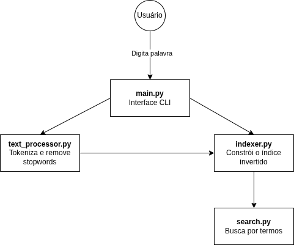

## DocFinder: Sistema de Busca de Documentos por Conteúdo com Índice Invertido

### Membros da Equipe
Yasmin Victoria Oliveira RA: 812308

## Definição da Aplicação
O projeto consiste no desenvolvimento de um sistema de busca textual que permite localizar documentos com base nas palavras contidas neles.
A proposta é construir um índice invertido, que associa cada palavra-chave aos documentos onde ela aparece, permitindo buscas rápidas e eficientes.
O sistema simula um mecanismo de busca simplificado, semelhante aos utilizados por grandes motores de busca como Google e Bing, porém focado em um conjunto restrito de documentos locais (textos, artigos, livros ou outros arquivos).

### Diagrama

